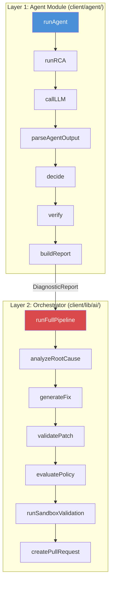
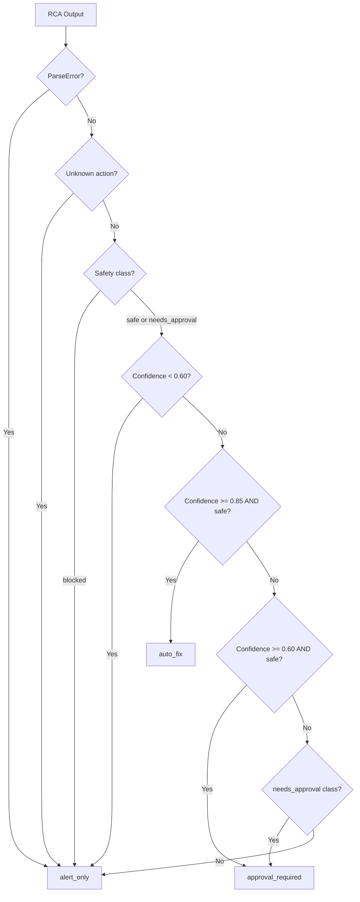
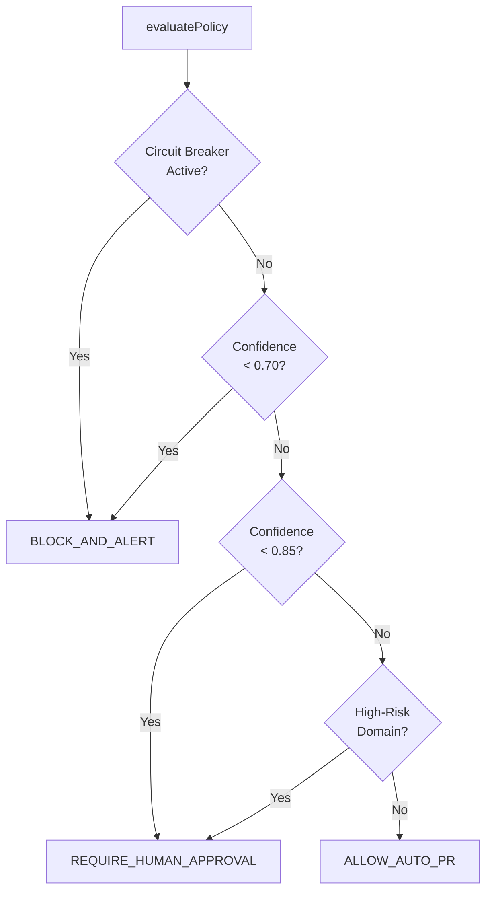

# 🤖 Recovera — Agentic AI System: Deep Analysis

> A complete breakdown of how the Agentic AI layer works, how it was designed, and how every module connects.

---

## 1. What Is the "Agentic AI" in Recovera?

The Agentic AI is the **autonomous decision-making brain** of Recovera. Unlike a simple "ask GPT and show the answer" integration, this system implements a **multi-step agent pipeline** that:

1. **Receives** a structured incident input (event type, resource state, logs, code context)
2. **Reasons** about the root cause via an LLM (Gemini → Groq fallback)
3. **Decides** what action to take based on confidence thresholds and safety classification
4. **Verifies** the outcome by checking the post-fix resource state
5. **Reports** a comprehensive diagnostic with risk scores, Slack notifications, and audit data

The key insight is that the AI is **never trusted blindly** — every LLM output passes through deterministic safety gates before any real-world action is taken.

---

## 2. Architecture Overview

The Agentic AI lives in **two separate layers** that work together:



| Layer | Location | Purpose | When It Runs |
|-------|----------|---------|--------------|
| **Agent Module** | `client/agent/` | Fast RCA + Decision + Verification | In the **hot path** — runs during incident detection |
| **Orchestrator** | `client/lib/ai/orchestrator.ts` | Fix generation + Safety + Sandbox + PR creation | In the **background** — runs after detection completes |

> **Important:** The two-layer design is intentional. Layer 1 must be **fast** (real-time incident triage). Layer 2 can be **slow** (cloning repos, running lint, pushing PRs).

---

## 3. Module-by-Module Breakdown

### 3.1 Entry Point: `runAgent()` 
**File**: `client/agent/agent/index.ts`

This is the main orchestrator for the agent module. It runs a **4-step pipeline**:

```
Step 1: Mock Check → Step 2: Idempotency Guard → Step 3: RCA → Step 4: Decision → Step 5: Verification → Step 6: Report
```

**Key design decisions:**

1. **Mock mode** (`AGENT_MOCK=true`): Returns a hardcoded fixture immediately. This prevents accidental LLM API calls during development and saves API costs.

2. **Idempotency guard**: If the incident is already `"done"` or `"running"`, the agent returns a skip report instead of re-analyzing. This prevents duplicate work when the same event is processed twice.

3. **Never-throw guarantee**: The entire pipeline is wrapped in a `try/catch`. Even if the LLM crashes, the agent returns a valid `DiagnosticReport` with `action_taken: "alert_only"` via the `fallback-handler.ts`. This is critical because the calling code (`detector.ts`) expects a report to persist to the database.

4. **Runtime hooks**: The `AgentRuntime` interface allows the backend to inject real AWS execution logic (e.g., actually disabling S3 public access) and then pass the post-fix state to the verifier. This separates "what to do" from "how to do it".

---

### 3.2 Type System
**File**: `client/agent/agent/types.ts`

The type system defines the **contract** between all agent modules:

| Type | Purpose |
|------|---------|
| `AgentInput` | What the agent receives: event type, logs, resource state, metadata, incident ID |
| `AgentOutput` | What the LLM produces: root cause, fix strategy, confidence, evidence, recommended action |
| `DecisionResult` | What the decision engine outputs: path (`auto_fix` / `approval_required` / `alert_only`), safety class |
| `VerificationResult` | Post-fix check: resolved? evidence? status? |
| `DiagnosticReport` | The final comprehensive report with all data aggregated |
| `ParseError` | Structured error when LLM output is malformed |
| `FallbackResponse` | Structured error when the entire pipeline fails |

**Event Types** supported:
- `S3_PUBLIC` — S3 bucket with public access
- `IAM_OVERPERMISSION` — IAM policy with wildcard `*` permissions
- `SG_OPEN_PORT` — Security group with `0.0.0.0/0` open
- `UNKNOWN` — Unclassified events

**Action Types** the LLM can recommend:
- `generate_fix` — AI should generate a code patch
- `rollback` — Revert to a previous known-good state
- `human_only` — Too complex for AI, escalate to human
- `alert_only` — Just notify, don't take action
- `unknown` — LLM couldn't determine what to do

---

### 3.3 Root Cause Analysis (RCA)
**File**: `client/agent/agent/rca.ts`

The RCA module is the **first intelligence step**. It:

1. **Short-circuits** for `UNKNOWN` events — returns a low-confidence (0.30) alert without calling the LLM. This saves API costs for unclassifiable events.

2. **Pre-evaluates** the input quality:
   - Is the resource `config` empty? → Will floor the confidence at 0.45 later
   - Are the `logs` empty? → Will append a disclaimer to the failure mechanism

3. **Calls the LLM** via `callLLM()` with the system prompt

4. **Parses** the raw JSON response via `parseAgentOutput()`

5. **Post-adjusts** confidence based on input quality (confidence flooring if config was empty)

> **Tip:** The pre/post-evaluation pattern is a form of **confidence calibration** — the agent doesn't fully trust the LLM's self-reported confidence when the input data was incomplete.

---

### 3.4 LLM Caller (Dual-Provider with Retry)
**File**: `client/agent/agent/llm-caller.ts`

This is the **resilience layer** for LLM calls. It implements:

```
Primary (Gemini) → 2 retries with 15s timeout each
     ↓ (if all fail)
Fallback (Groq) → 2 retries with 15s timeout each
     ↓ (if all fail)
Throw LLMError("both_providers_failed")
```

**How it works:**

| Component | Detail |
|-----------|--------|
| **Primary** | Gemini via `generativelanguage.googleapis.com` REST API |
| **Fallback** | Groq via `api.groq.com` OpenAI-compatible API |
| **Timeout** | 15 seconds per attempt via `AbortController` |
| **Retries** | 2 per provider (so up to 4 total LLM calls) |
| **JSON mode** | Gemini uses `responseMimeType: "application/json"`, Groq uses `response_format: { type: "json_object" }` |

**Why raw `fetch` instead of Vercel AI SDK?**
The agent module uses **raw HTTP calls** to Gemini/Groq (not the Vercel AI SDK). This is deliberate:
- Layer 1 (Agent) needs to be lightweight and fast — no SDK overhead
- Layer 2 (Orchestrator/fixGenerator) uses `generateObject` from Vercel AI SDK because it needs Zod schema enforcement for structured output

**Provider config** is in `client/agent/agent/provider-config.ts`:
- Primary: `gemini-1.5-flash` (configurable via `GEMINI_MODEL` env)
- Fallback: `llama-3.1-8b-instant` (configurable via `GROQ_MODEL` env)

---

### 3.5 Output Parser (Zod Validation + Safety Clamping)
**File**: `client/agent/agent/output-parser.ts`

The parser is the **trust boundary** between the LLM and the rest of the system:

1. **Strips markdown fences** — LLMs often wrap JSON in ` ```json ``` ` even when told not to
2. **JSON.parse** — catches completely malformed output
3. **Zod schema validation** — enforces the exact shape of `AgentOutput`
4. **Confidence clamping**:
   - If confidence is NaN, negative, or >1 → clamped to `0.40`
   - If confidence > 0.93 → clamped to `0.93` (LLMs tend to be overconfident)
5. **Action coercion** — if the LLM returns an unknown action string, it's coerced to `"unknown"` (which the decision engine will route to `alert_only`)

> **Warning:** The 0.93 confidence cap is a critical safety measure. LLMs frequently return `confidence: 0.95` or `1.0` even when their analysis is mediocre. Capping at 0.93 ensures the system never treats LLM output as "certain".

---

### 3.6 Decision Engine (Deterministic Routing)
**File**: `client/agent/agent/decision-engine.ts`

This is a **pure function** (no side effects, no async, no DB calls) that maps the LLM output to one of three decision paths:



**Confidence thresholds:**
| Range | Path | What Happens |
|-------|------|-------------|
| `< 0.60` | `alert_only` | Just notify engineers, take no action |
| `0.60 – 0.84` | `approval_required` | Generate fix but require human sign-off |
| `>= 0.85` + `safe` class | `auto_fix` | Fully autonomous — generate fix, validate, open PR |

**Safety classes** come from `client/agent/tools/safety-registry.ts`:
| Action | Safety Class |
|--------|-------------|
| `generate_fix` | `safe` |
| `alert_only` | `safe` |
| `rollback` | `needs_approval` |
| `human_only` | `blocked` |
| `unknown` | `blocked` |

---

### 3.7 Verifier (Post-Fix State Checker)
**File**: `client/agent/verification/verifier.ts`

The verifier checks whether a fix **actually worked** by inspecting the resource's post-fix configuration:

| Event | What It Checks | Resolved If |
|-------|----------------|-------------|
| `S3_PUBLIC` | `PublicAccessBlockConfiguration` | `BlockPublicAcls` AND `BlockPublicPolicy` are both `true` |
| `IAM_OVERPERMISSION` | `PolicyDocument` statements | No Allow statement with `Action: "*"` |
| `SG_OPEN_PORT` | `IpPermissions` rules | No rule with `CidrIp: "0.0.0.0/0"` |
| `UNKNOWN` | Nothing | Returns `pending` (can't verify automatically) |

The verifier includes a configurable **delay** (default 3 seconds) to wait for AWS state propagation before checking.

> **Note:** Verification only runs for `auto_fix` decisions. If the decision was `approval_required` or `alert_only`, verification is skipped and marked as `pending`.

---

### 3.8 Reporter (Diagnostic Report Builder)
**File**: `client/agent/agent/reporter.ts`

The reporter compiles the final `DiagnosticReport` by:

1. **Calculating risk score**:
   - `auto_fix` with high confidence → `1.0 - confidence` (e.g., 0.90 conf → 0.10 risk)
   - `approval_required` → fixed at `0.50`
   - `alert_only` → fixed at `0.80`
   - `UNKNOWN` event → `1.00` (maximum risk)

2. **Determining human review requirement** — true if the decision was anything other than a successful auto-fix

3. **Generating a human-readable summary** — makes an additional LLM call to summarize the diagnosis in 2 sentences for non-technical managers (with fallback to a template string if the LLM fails)

4. **Building Slack notification payload** — structured blocks with root cause, confidence, risk, and action

---

### 3.9 System Prompt + Few-Shot Examples
**Files**: `client/agent/prompts/system-prompt.ts` · `client/agent/prompts/few-shot-examples.ts`

The prompt engineering is designed to:

1. **Define the role**: "Senior AWS SRE analyst"
2. **Enforce JSON-only output**: "No prose. No markdown fences."
3. **Specify the exact schema** the LLM must produce
4. **Calibrate confidence**:
   - Direct evidence in logs + resource state → `0.75–0.90`
   - Resource state only → `0.55–0.75`
   - Neither confirms → `0.30–0.55`
5. **Provide few-shot examples**: One positive case (S3 public bucket with high confidence) and one negative case (unknown event with low confidence)

---

### 3.10 Orchestrator (Background Pipeline)
**File**: `client/lib/ai/orchestrator.ts`

The orchestrator runs **after** the agent module completes. It's the "heavy lifting" layer:

```
Step 1: RCA (via Vercel AI SDK)
  ↓
Step 2: Fix Generation (Gemini → Groq, Zod schema)
  ↓
Step 3: Static Patch Validation
  ↓
Step 4: Safety Policy Evaluation (policyEngine.ts)
  ↓
Step 5: Sandbox Validation (clone repo, apply patch, run lint)
  ↓
Step 6: PR Creation (git clone → apply → push → Octokit)
```

> **Important:** **Why two RCA steps?** Layer 1's RCA (raw HTTP to Gemini) is fast and lightweight — it produces the `DiagnosticReport` for the dashboard. Layer 2's RCA (via Vercel AI SDK + `generateObject`) is slower but produces **Zod-validated structured output** needed for fix generation.

---

### 3.11 Fix Generator (Structured Output via Vercel AI SDK)
**File**: `client/lib/ai/fixGenerator.ts`

Uses `generateObject` from the Vercel AI SDK with a Zod schema to guarantee the LLM returns:

```typescript
{
  patchDiff: string,    // Unified diff (git apply compatible)
  changeSummary: string, // Human-readable explanation
  riskScore: number      // 0.0 to 1.0
}
```

The system prompt constrains the LLM to:
- Modify no more than **3 files**
- Change no more than **120 lines** total
- Not touch blocked paths (`prisma/migrations`, `.env`, auth/payment code)

---

### 3.12 Safety Policy Engine (3-Layer Guard)
**File**: `client/lib/safety/policyEngine.ts`

This is the **last line of defense** before any auto-fix reaches production:



**Circuit Breaker**: Trips if **5+ patches** have `FAILED_AFTER_APPLY` status in the last hour. Can also be manually activated via `SystemSetting.MANUAL_CIRCUIT_BREAKER = "true"`.

**High-Risk Domains** (hardcoded keywords checked in the patch diff):
`auth`, `login`, `billing`, `payment`, `stripe`, `secret`, `key`, `migration`, `prisma/migrations`

Every policy decision is **recorded** in the `SafetyAuditLog` table for full traceability.

---

## 4. End-to-End Data Flow

Here's exactly how data flows from a production error to a Pull Request:

```
1. AWS CloudWatch Log → Kinesis Firehose → POST /api/ingest/logs
2. Ingest route decodes base64, normalizes log → writes to DetectionQueue
3. Detector picks up from queue → generates SHA-256 fingerprint → upserts Incident
4. Detector calls runAgent(input) with log data + resource state
   ├── 4a. RCA: callLLM() → Gemini (15s timeout, 2 retries) → Groq fallback
   ├── 4b. Parse: Zod validation + confidence clamping (max 0.93)
   ├── 4c. Decide: confidence thresholds + safety registry → auto_fix / approval / alert
   ├── 4d. Verify: check post_fix_state against event-specific rules
   └── 4e. Report: DiagnosticReport with risk score + Slack payload
5. Detector persists report to DetectionAudit, IncidentRca, IncidentAction (in DB transaction)
6. Detector triggers runFullPipeline() in background
   ├── 6a. generateFix(): Gemini + Zod schema → patchDiff + changeSummary + riskScore
   ├── 6b. validatePatch(): static analysis (no forbidden patterns)
   ├── 6c. evaluatePolicy(): circuit breaker → confidence → domain risk → decision
   ├── 6d. runSandboxValidation(): git clone → apply patch → npm install --ignore-scripts → lint
   └── 6e. createPullRequest(): git push → octokit.pulls.create() → PR URL saved
```

---

## 5. How This Was Planned (Design Philosophy)

### 5.1 Separation of Concerns
The agent module (`client/agent/`) is **self-contained** with its own:
- Types, errors, tests, docs, prompts
- No dependency on Prisma or Next.js
- Can be tested in isolation

The orchestrator (`client/lib/ai/`) is **backend-coupled**:
- Imports Prisma for DB writes
- Imports safety, sandbox, and GitHub modules
- Runs in the Next.js server context

### 5.2 Defense in Depth
The system has **5 safety layers** preventing bad AI output from reaching production:

| Layer | Location | What It Catches |
|-------|----------|----------------|
| **1. Output Parser** | `output-parser.ts` | Malformed JSON, missing fields, overconfident scores |
| **2. Decision Engine** | `decision-engine.ts` | Low confidence, blocked actions, unknown actions |
| **3. Safety Registry** | `safety-registry.ts` | Maps actions to safety classes (safe/needs_approval/blocked) |
| **4. Policy Engine** | `policyEngine.ts` | Circuit breaker, domain risk, confidence thresholds |
| **5. Sandbox** | `sandbox/runner.ts` | Patch doesn't compile, lint fails, build breaks |

### 5.3 Graceful Degradation
At every failure point, the system degrades to `alert_only` rather than crashing:

- LLM returns garbage → `ParseError` → `alert_only`
- Both LLM providers fail → `FallbackResponse` → `alert_only`
- Confidence too low → `alert_only`
- Safety class blocked → `alert_only`
- Policy engine blocks → `BLOCK_AND_ALERT`
- Sandbox fails → Pipeline stops (no PR)
- Agent crashes entirely → `handleFailure()` → still returns a valid `DiagnosticReport`

### 5.4 Audit Everything
Every step is recorded:
- `DetectionAudit` — full diagnostic report JSON
- `IncidentRca` — versioned RCA outputs
- `SafetyAuditLog` — every policy decision with reason codes
- `IncidentAction` — PR URLs, branch names, commit SHAs
- `PatchArtifact` — the actual diff, risk score, validation status

---

## 6. File Map

| File | Lines | Role |
|------|-------|------|
| `client/agent/agent/index.ts` | 260 | Agent entry point — orchestrates the 4-step pipeline |
| `client/agent/agent/types.ts` | 154 | All type definitions and contracts |
| `client/agent/agent/rca.ts` | 57 | Root cause analysis with pre/post adjustments |
| `client/agent/agent/llm-caller.ts` | 168 | Dual-provider LLM calls with retry + timeout |
| `client/agent/agent/output-parser.ts` | 102 | Zod validation + confidence clamping |
| `client/agent/agent/decision-engine.ts` | 102 | Pure function — confidence thresholds + safety routing |
| `client/agent/agent/reporter.ts` | 91 | Builds final DiagnosticReport with risk scores |
| `client/agent/agent/fallback-handler.ts` | 37 | Crash handler — always returns a valid response |
| `client/agent/agent/errors.ts` | 31 | Custom error classes (LLMError, AgentError) |
| `client/agent/agent/provider-config.ts` | 52 | Gemini/Groq configuration with env validation |
| `client/agent/tools/safety-registry.ts` | 21 | Action → Safety class mapping |
| `client/agent/verification/verifier.ts` | 154 | Post-fix state validation per event type |
| `client/agent/prompts/system-prompt.ts` | 23 | LLM system prompt with schema + constraints |
| `client/agent/prompts/few-shot-examples.ts` | 82 | Positive + negative few-shot examples |
| `client/lib/ai/orchestrator.ts` | 147 | Background pipeline: fix → validate → safety → PR |
| `client/lib/ai/fixGenerator.ts` | 108 | Generates unified diff via Vercel AI SDK + Zod |
| `client/lib/safety/policyEngine.ts` | 149 | 3-layer safety: circuit breaker + confidence + domain |

**Total**: ~1,728 lines of TypeScript dedicated to the Agentic AI system.
