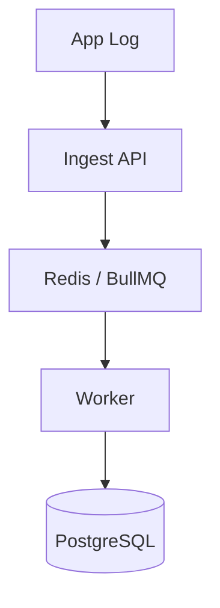

# Part 2: Architecture & Foundation

Recovera is built on a modern, event-driven architecture designed to scale.

## Core Components
- **Frontend**: Next.js 16 (App Router), React 19, Tailwind CSS. This is the main dashboard for engineers.
- **Backend APIs**: Next.js API Routes handle ingestion and GitHub webhooks.
- **Queueing (BullMQ + Redis)**: Critical for background tasks like RCA analysis without blocking the main thread.
- **Database**: PostgreSQL with Prisma ORM stores incident histories, policies, and audit logs.

### Detailed Example: Handling an Event
When an error occurs, here is how the system routes it:
1. **Production App** sends a log payload to the `/api/ingest` endpoint.
2. **Ingest API** validates the payload and pushes an event to a Redis Queue via BullMQ.
3. **Worker Service** picks up the event, normalizes it, and stores the structured data in PostgreSQL.

